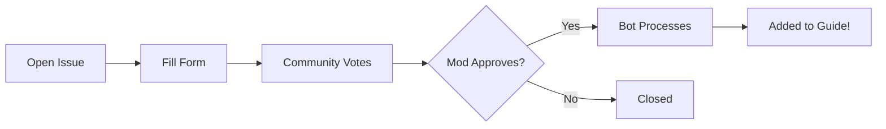

# 🤝 Contributing to Git Guide

Thank you for your interest in contributing! This project uses an **IssueOps** approach - all contributions are made through GitHub Issues.

## How It Works



## Adding a Place

### Step 1: Open an Issue

1. Go to [**Issues → New Issue**](../../issues/new/choose)
2. Select **"📍 Propose a Place"**
3. Fill out the form completely

### Step 2: Get Votes

- Share your proposal with the community
- Other users vote using 👍 (support) or 👎 (oppose)
- **100+ net votes** are needed for approval

### Step 3: Wait for Moderation

- A moderator will review proposals with enough votes
- If approved, they add the `mod-approved` label
- The bot runs every 6 hours to process approved proposals

### Step 4: Automatic Processing

When your proposal is processed:
1. ✅ City is validated using OpenStreetMap
2. ✅ Markdown file is created
3. ✅ Indexes are updated
4. ✅ Issue is closed with a success comment

## Guidelines

### What Makes a Good Proposal?

✅ **Do:**
- Suggest places you've personally visited
- Provide specific, helpful descriptions
- Include accurate addresses and websites
- Be honest about what makes the place special

❌ **Don't:**
- Spam promotional content
- Add places you haven't verified
- Duplicate existing entries
- Submit inappropriate content

### Categories

| Category | What to Include |
|----------|-----------------|
| **Eat** 🍽️ | Restaurants, cafes, bakeries, street food, bars |
| **See** 👀 | Landmarks, museums, parks, viewpoints, attractions |

### Quality Standards

- **Description**: 2-3 sentences explaining why this place is special
- **Address**: Full address or Google Maps link preferred
- **Website**: Official website or verified social media

## For Moderators

### Approval Checklist

Before adding `mod-approved`:

- [ ] Place appears to be real and legitimate
- [ ] Description is appropriate and helpful
- [ ] Not a duplicate of existing entry
- [ ] Has sufficient community votes (100+)
- [ ] City name is recognizable

### Labels Reference

| Label | Meaning |
|-------|---------|
| `proposal` | Initial proposal submission |
| `pending-votes` | Waiting for community votes |
| `mod-approved` | Approved for processing |
| `accepted` | Successfully added to guide |
| `rejected` | Not approved |
| `validation-failed` | City validation failed |

## Technical Details

### File Structure

```
countries/
├── README.md           # Root index
├── Italy/
│   ├── README.md       # Country index
│   └── Rome/
│       ├── README.md   # City index
│       ├── Eat/
│       │   └── trattoria_da_mario.md
│       └── See/
│           └── colosseum.md
```

### Automation

- **Trigger**: Every 6 hours or when `mod-approved` label is added
- **Validation**: Uses geopy (OpenStreetMap) for city verification
- **Indexing**: All README files are auto-generated

## Questions?

- 💬 [Start a Discussion](../../discussions)
- 🐛 [Report a Bug](../../issues/new)

---

> Built with ❤️ using IssueOps
