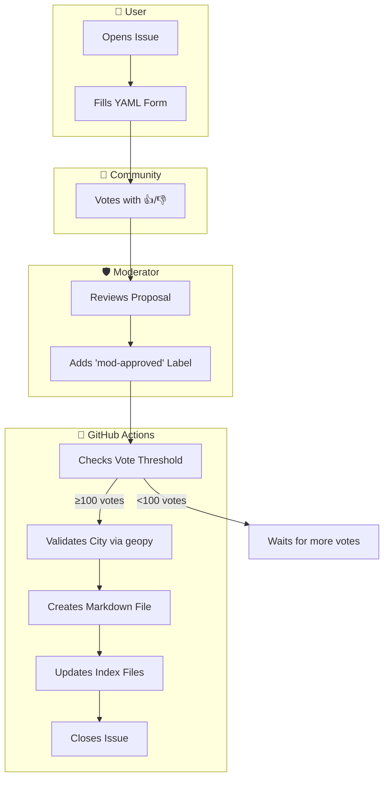

# 🌍 Git Guide

> A decentralized, open-source travel directory built entirely on GitHub.

[](https://github.com/your-org/git-guide/actions/workflows/vote_manager.yml)

## What is Git Guide?

Git Guide is a **community-curated travel directory** that uses GitHub as both the frontend and backend. No databases, no servers - just Markdown files and GitHub Actions!

**Key Features:**
- 🗳️ **Community Voting** - Places are added based on community consensus
- 🤖 **Fully Automated** - Bot handles all file creation and indexing
- 📁 **Git-based CMS** - All data stored as Markdown files
- 🌐 **Open Source** - Transparent, forkable, and self-hostable

## How It Works



## 📂 Browse the Guide

**[→ Browse All Countries](countries/README.md)**

## 🚀 Quick Start

### Propose a New Place

1. **[Open a new Issue](../../issues/new/choose)** and select "📍 Propose a Place"
2. Fill out the form with place details
3. Wait for community votes (👍 / 👎)
4. Once approved by moderators, the bot adds it automatically!

### Vote on Proposals

1. Browse [open proposals](../../issues?q=is%3Aissue+is%3Aopen+label%3Aproposal)
2. React with 👍 to support or 👎 to oppose
3. Your vote counts toward the 100-vote threshold

## 📁 Data Structure

All guide data is stored as Markdown files in a strict hierarchy:

```
countries/
├── README.md                    # Index of all countries
├── Italy/
│   ├── README.md                # Index of Italian cities
│   ├── Rome/
│   │   ├── README.md            # Index of Rome places
│   │   ├── Eat/
│   │   │   └── trattoria_da_mario.md
│   │   └── See/
│   │       └── colosseum.md
│   └── Florence/
│       └── ...
└── Japan/
    └── Tokyo/
        └── ...
```

## 🔧 Technical Details

### Architecture

| Component | Technology |
|-----------|------------|
| Frontend | GitHub Issues (YAML Forms) |
| Backend | GitHub Actions |
| Database | Markdown Files (Git) |
| Geo Validation | geopy (OpenStreetMap) |
| API | PyGithub |

### Voting Formula

A place is accepted when:
```
net_votes = thumbs_up - thumbs_down
accepted = net_votes >= 100 AND mod_approved == true
```

### Automation Triggers

- ⏰ **Scheduled**: Every 6 hours
- 🏷️ **On Label**: When `mod-approved` is added
- 🖱️ **Manual**: Via workflow dispatch

## 🤝 Contributing

See **[CONTRIBUTING.md](CONTRIBUTING.md)** for detailed guidelines.

**Quick Links:**
- [Propose a Place](../../issues/new/choose)
- [View Open Proposals](../../issues?q=is%3Aissue+is%3Aopen+label%3Aproposal)
- [Start a Discussion](../../discussions)

## 🛡️ For Maintainers

### Required Labels

Create these labels in your repository:

| Label | Color | Description |
|-------|-------|-------------|
| `proposal` | `#0E8A16` | Initial proposal submission |
| `pending-votes` | `#FBCA04` | Waiting for community votes |
| `mod-approved` | `#1D76DB` | Approved for bot processing |
| `accepted` | `#0E8A16` | Successfully added to guide |
| `rejected` | `#B60205` | Not approved |
| `validation-failed` | `#D93F0B` | City validation failed |

### Environment Variables

The GitHub Action uses:
- `GITHUB_TOKEN` - Automatically provided
- `GITHUB_REPOSITORY` - Automatically provided

---

<p align="center">
  Built with ❤️ using <strong>IssueOps</strong><br>
  <sub>No databases. No servers. Just Git.</sub>
</p>
